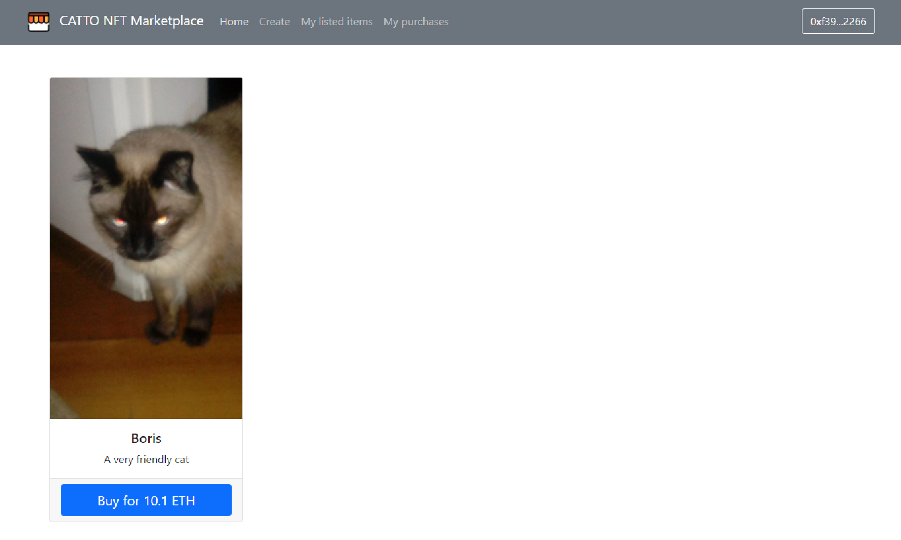
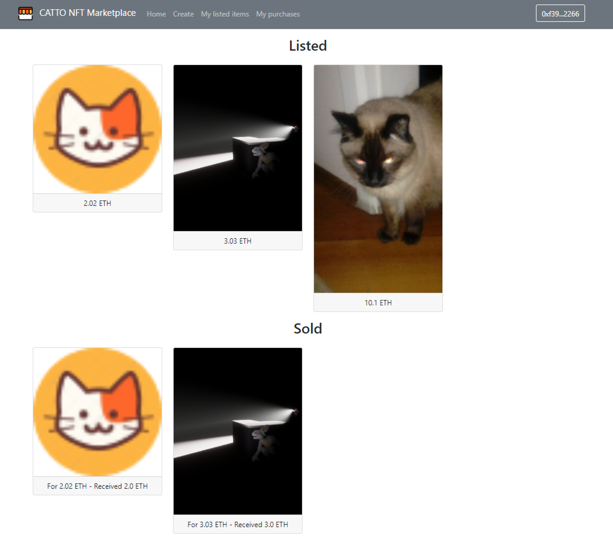

<div id="top"></div>

<!-- TITLE -->
<div align="center">
  <a href="https://github.com/gumastro/nft_marketplace">
    
  </a>

<h3 align="center">Catto NFT Marketplace</h3>

  <p align="center">
    Decentralized NFT Marketplace
    <br />
  </p>
</div>

<!-- TABLE OF CONTENTS -->
<details>
  <summary>Table of Contents</summary>
  <ol>
    <li>
      <a href="#computer-about-the-project">About The Project</a>
      <ul>
        <li><a href="#built-with">Built With</a></li>
      </ul>
    </li>
    <li>
      <a href="#hammer_and_wrench-getting-started">Getting Started</a>
      <ul>
        <li><a href="#installation">Installation</a></li>
      </ul>
    </li>
    <li><a href="#star2-usage">Usage</a></li>
    <li><a href="#memo-license">License</a></li>
    <li><a href="#mailbox-contact">Contact</a></li>
  </ol>
</details>

<!-- ABOUT THE PROJECT -->
## :computer: About The Project

&nbsp; 

Decentralized NFT Marketplace powered by the ethereum blockchain that uses IPFS to store data and create ERC721 tokens that can be made available to be bought and sold

<p align="right">(<a href="#top">back to top</a>)</p>

### Built With

* [Solidity](https://docs.soliditylang.org/en/v0.8.12/)
* [ethers.js](https://docs.ethers.io/v5/)
* [Hardhat](https://hardhat.org)
* [IPFS](https://www.infura.io/product/ipfs)
* [Chai.js](https://www.chaijs.com)
* [React.js](https://reactjs.org/)
* [Node.js](https://nodejs.org/en/)

<p align="right">(<a href="#top">back to top</a>)</p>

<!-- GETTING STARTED -->
## :hammer_and_wrench: Getting Started

### Installation

1. Clone the repo
   ```sh
   git clone https://github.com/gumastro/nft_marketplace.git
   cd nft_marketplace
   ```
2. Install NPM packages
   ```sh
   npm install
   ```
3. Boot up local development blockchain
    ```sh
    npx hardhat node
    ```
4. Connect development blockchain accounts to Metamask
    * Copy private key of the addresses and import to Metamask
    * Make sure your Metamask is connected to the right network (same as Hardhat test network)
        * RPC URL
        `http://127.0.0.1:8545`
        * Chain ID
        `31337`
5. Migrate Smart Contracts
    ```sh
    npx hardhat run src/backend/scripts/deploy.js --network localhost
    ```
6. Run tests
    ```sh
    npx hardhat test
    ```
7. Start NPM packages
   ```sh
   npm run start
   ```
8. Create and trade NFTs!

<p align="right">(<a href="#top">back to top</a>)</p>

<!-- USAGE EXAMPLES -->
## :star2: Usage

### Create & List NFT

1. Click on Create option
2. Select a file to be the NFT image
3. Give it a name and a description
4. Set the price in ETH
5. Click on Create & List NFT!

&nbsp; 

6. Give permission to access your NFT on Metamask pop-up
7. Confirm transaction on Metamask pop-up
8. Enjoy your newly created NFT!

### Buy NFT

1. Click on Home
2. Choose a NFT of your liking
3. Click on Buy for XXX ETH!

&nbsp; 

5. Confirm transaction on Metamask pop-up
6. Enjoy your NFT!

<p align="right">(<a href="#top">back to top</a>)</p>

### View listed and purchased NFTs

* You can also check all your listed NFTs (even the sold ones) on My listed items
* Or see all the NFTs you purchased on My purchases

&nbsp; 

<!-- LICENSE -->
## :memo: License

Distributed under the MIT License. See `LICENSE.txt` for more information.

<p align="right">(<a href="#top">back to top</a>)</p>

<!-- CONTACT -->
## :mailbox: Contact

Gustavo Tuani Mastrobuono - gumastro@usp.br

<p align="right">(<a href="#top">back to top</a>)</p>

<!-- MARKDOWN LINKS & IMAGES -->
[mktplace-catto-screenshot]: imgs/main.png
[create-nft-screenshot]: imgs/create.png
[sell-nft-screenshot]: imgs/main.png
[view-nft-screenshot]: imgs/view.png
